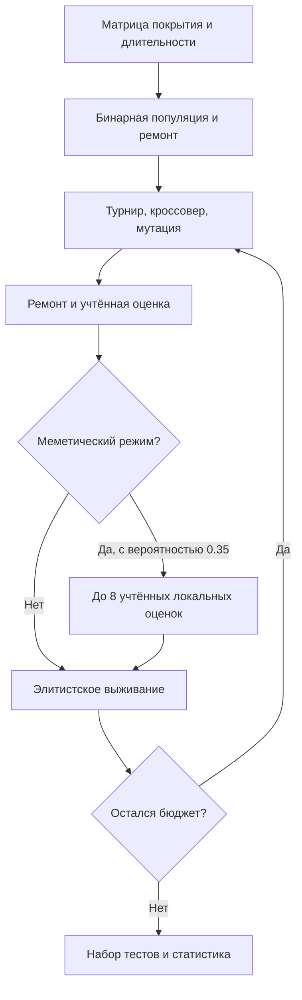
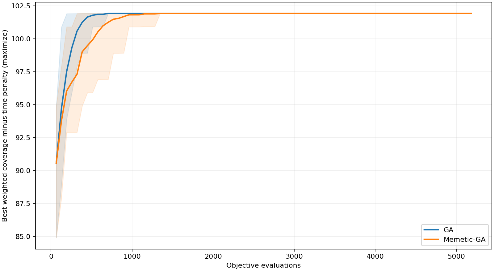
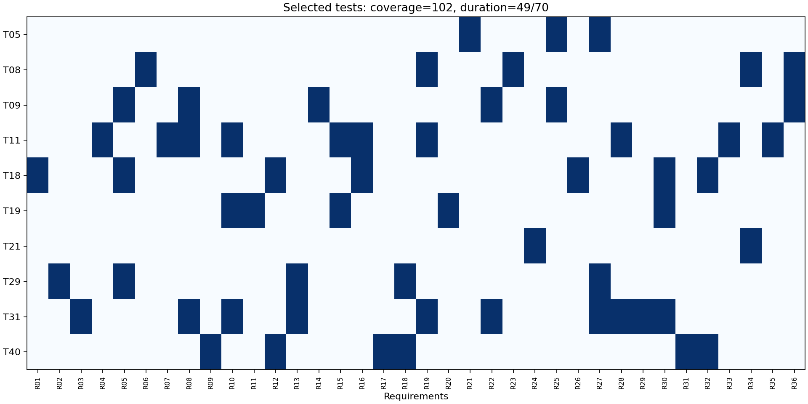
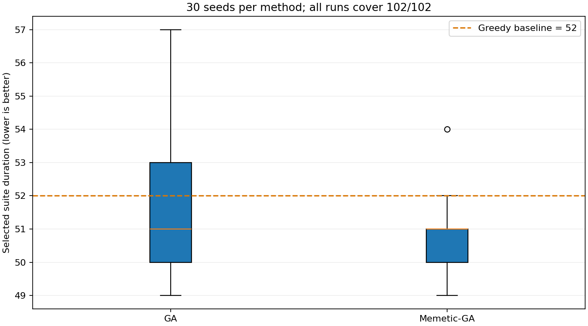

# Лабораторная работа № 4

## Отбор тестов · меметический поиск

**Дисциплина:** «Эволюционное программирование и генетические алгоритмы»  
**Группа:** 507 · **номер студента:** 17 · **год:** 2026  
**Вариант:** `V = 1 + ((17 × 17 + 7 × 0 + 26) mod 20) = 16`.

Основание — предоставленный комплекс лабораторных работ Р. В. Душкина, разделы 1.2–1.5 и соответствующее задание. ФИО не указано, вымышленные данные не добавлялись. Все ключевые эволюционные операторы реализованы в исходниках без готовых оптимизаторов.

## 1. Заявка и архитектура

Проект варианта 16: генетический алгоритм для программной инженерии, **отбор регрессионных тестов** при ограниченном времени CI. Заявка составлена до реализации: [PROPOSAL.md](docs/PROPOSAL.md). Подготовка заявки не является подтверждением согласования преподавателем.

Компоненты: генератор синтетического набора → модель покрытия/стоимости → восстановление допустимости → ГА или меметический ГА → единый счётчик оценок → статистика и демонстрация. `model.py` содержит предметную модель и поиск; `main.py` управляет независимыми запусками; `common.py` отвечает за артефакты. Тестовый набор не исполняет реальные тесты приложения: он моделирует их покрытие.

## 2. Формальная задача

50 тестов, 36 требований. $x_i\in\{0,1\}$ означает выбор теста. Матрица $A_{ij}$ задаёт покрытие, $t_i$ — длительность, $w_j$ — важность. Ограничение: $T(x)=\sum t_ix_i\le70$. Взвешенное покрытие $C(x)=\sum_jw_j[\exists i:x_iA_{ij}=1]$. Максимизируется

$$F(x)=C(x)-0.1\,T(x)/70.$$

Покрытие целочисленное; любое его увеличение хотя бы на 1 важнее возможного изменения временного штрафа до 0.1. Таким образом реализована лексикографическая цель: сначала покрытие, затем длительность. Генотип — бинарная маска, фенотип — список имён тестов. Пустое решение допустимо, но бесполезно.

Синтетика: seed 2650717; вероятность покрытия одной пары 0.10, затем каждому требованию принудительно обеспечивается хотя бы один покрывающий тест; длительности 3–15, важности 1–5. Данные целиком в `data/tests.json`. Полная сумма важностей 102 — строгая верхняя граница покрытия, **не гарантия минимальности времени**.

## 3. Алгоритмы и честный бюджет

Базовый ГА: 64 особи, независимая начальная вероятность включения теста 0.18, турнир из 3, равномерный кроссовер с вероятностью 0.9, побитовая мутация с вероятностью 1/50, элитистский отбор лучших 64 из родителей и потомков. Ремонт удаляет выбранные тесты в порядке возрастания статического отношения «индивидуальное взвешенное покрытие / время» до допустимости. Он использует только входные данные и не скрывает дополнительные оценки целевой функции.

Меметический вариант после оценки потомка с вероятностью 0.35 проверяет до 8 случайных битовых соседей с ремонтом, последовательно принимая каждое улучшение. Популяция, скрещивание, мутация и ремонт совпадают с базовым ГА. Глобальный счётчик учитывает **каждого** начального кандидата, потомка и локального соседа, включая повторные маски. Лимит **5184 оценки**; последняя генерация/локальный поиск могут быть прерваны ровно на лимите. Кеширования нет.



Контрольные точки графика — 64, 128, …, 5184 оценки. Сравнение по поколениям было бы некорректным: меметический вариант тратит существенную долю бюджета внутри локального поиска. Поле `local_evaluations` позволяет проверить этот расход. Время измерено отдельно; одинаковое число оценок не означает одинаковое время.

## 4. Серия и демонстрация

30 независимых seed 47000–47029 для каждого алгоритма. ГА и меметический вариант используют одинаковые начальные популяции при общем seed. Простой жадный ориентир добавляет тест с максимальным дополнительным покрытием на единицу времени; он детерминированный и не включён в равнобюджетную статистическую серию. Его результат отдельно сохранён в `greedy.json`.





Для разностей Memetic−GA вычислен парный percentile bootstrap среднего по 10 000 перевыборок 30 пар, seed 50717. Это описательный интервал для данного эксперимента; он не является универсальной гарантией. Все пары и исходные данные доступны.



## 5. Обсуждение

Оба метода достигли покрытия 102/102 во всех запусках. Поэтому различия конечного score отражают длительность, а не потерянные требования. Меметический вариант немного снижает среднее время выбранного набора, но интервал парной средней разницы включает ноль: уверенно заявлять превосходство по этой серии нельзя. Жадный baseline тоже покрывает все требования, показывая, что на данном экземпляре основная сложность — дальнейшее сокращение тестового набора.

Критерий приемлемости: соблюдение лимита 70, полное покрытие всех 36 требований и малое время. По покрытию получен строгий оптимум (верхняя граница достигнута), по длительности — только лучшее найденное решение без точного сертификата.

Ограничения: один синтетический экземпляр; статическое бинарное покрытие не учитывает вероятность обнаружения дефектов, flaky-тесты, зависимости и порядок запуска, параллельные CI-исполнители. Более содержательная проверка потребует матриц реального покрытия, нескольких бюджетов и экземпляров, а также сравнения с точным целочисленным решателем. Улучшения алгоритма — обмен выбранного/невыбранного теста, адаптивная доля локального поиска, многокритериальное покрытие/время/нестабильность.

Сценарий демонстрации на 6 минут: [DEMO.md](docs/DEMO.md).

## Численные результаты выполненной серии


Минимум и максимум — значения метрики, направление оптимизации см. в отчёте. Стандартное отклонение выборочное (ddof=1). Полоса на графике — min–max, не доверительный интервал.

| Метод | Запусков | Минимум | Среднее | Медиана | Std | Максимум | Время, с |
|---|---:|---:|---:|---:|---:|---:|---:|
| GA | 30 | 101.919 | 101.927 | 101.927 | 0.00282453 | 101.93 | 0.1869 |
| Memetic-GA | 30 | 101.923 | 101.928 | 101.927 | 0.00136044 | 101.93 | 0.1490 |

Парное сравнение: средняя разница score 0.00104762; 95% bootstrap-интервал [-9.523809524030943e-05, 0.0021904761904778763]; побед/ничьих/поражений 14/8/8.

Лучший набор: T05, T08, T09, T11, T18, T19, T21, T29, T31, T40; время 49, покрытие 102.

## Полная конфигурация

```json
{
  "population": 64,
  "budget": 5184,
  "runs": 30,
  "first_seed": 47000,
  "mutation_probability": 0.02,
  "crossover_probability": 0.9,
  "local_probability": 0.35,
  "group": 507,
  "student_number": 17,
  "year": 2026,
  "variant": 16
}
```

## Воспроизводимость и проверка

Исполненная серия: Python 3.12.14, NumPy 2.3.5, Matplotlib 3.10.8. Все таблицы получены выполнением программы, не заполнены вручную. Время зависит от оборудования и нагрузки. Побитовая идентичность между разными версиями библиотек/платформами не гарантируется. Исходные seed и число оценок записаны по каждому запуску.

`python -m unittest discover -v` проверяет математические инварианты, допустимость, воспроизводимость и бюджет. Журнал — `docs/TEST_LOG.txt`. Для повторного эксперимента с иными параметрами используйте отдельную папку; данный отчёт описывает приложенную полную серию и автоматически не переписывается.

## Источник задания

Душкин Р. В. «Дисциплина “Эволюционное программирование и генетические алгоритмы”. Комплекс лабораторных работ», предоставленный PDF. Внешние изображения и готовые оптимизаторы не использовались.
